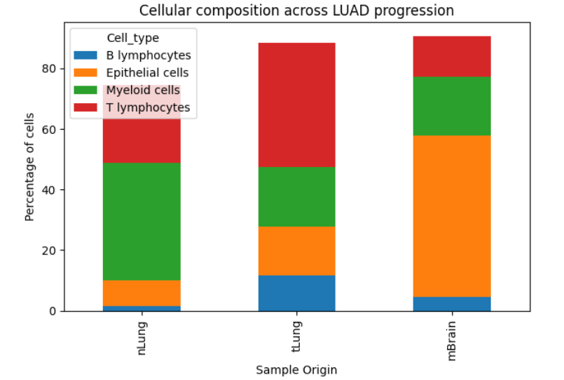
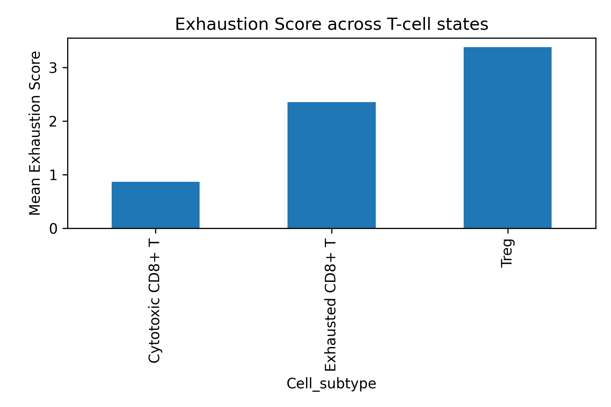
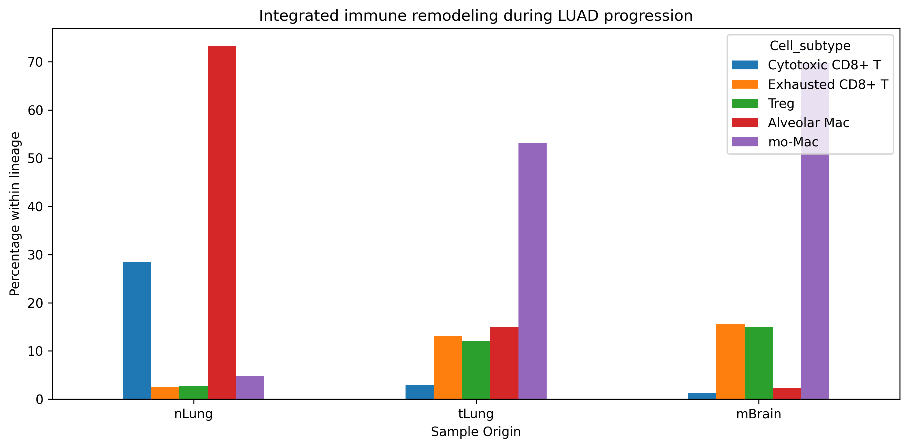
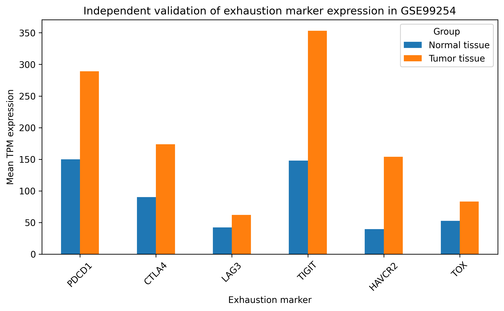

# Single-cell characterization of T-cell exhaustion and macrophage remodeling during LUAD progression and brain metastasis

## Overview

This repository presents a comprehensive single-cell RNA sequencing (scRNA-seq) analysis investigating immune microenvironment remodeling during lung adenocarcinoma (LUAD) progression and brain metastasis formation.

Using publicly available datasets, this study explores how immune-cell populations and exhaustion-associated transcriptional programs evolve during disease progression. Particular emphasis is placed on T-cell dysfunction, immune escape mechanisms, and macrophage remodeling within metastatic lesions.

---
## Main Findings

### 1. Immune-cell composition during LUAD progression



Progressive remodeling of the immune microenvironment across normal lung tissue, primary tumors, and brain metastases.

---

### 2. Progressive T-cell exhaustion



Exhaustion-associated transcriptional programs increase during disease progression and reach their highest levels in brain metastases.

---

### 3. Integrated model of immune remodeling



Summary model illustrating coordinated T-cell exhaustion, macrophage remodeling, and immune escape during metastatic progression.

---


## Research Question

**Which cellular populations and transcriptional programs are associated with immune dysfunction and brain metastasis development in lung adenocarcinoma?**

### Objectives

* Characterize immune-cell composition changes during LUAD progression.
* Investigate T-cell exhaustion dynamics across disease stages.
* Analyze macrophage remodeling associated with metastatic progression.
* Identify clinically relevant immune checkpoint pathways.
* Validate exhaustion-associated transcriptional programs in an independent cohort.

---

## Skills Demonstrated

### Bioinformatics

* Single-cell RNA-seq analysis
* Tumor microenvironment profiling
* Immune-cell annotation
* Differential abundance analysis
* Gene-expression analysis
* Biomarker discovery

### Computational

* Python
* Pandas
* NumPy
* SciPy
* Statistical analysis
* Data visualization

### Cancer Biology

* Tumor immunology
* T-cell exhaustion
* Brain metastasis biology
* Macrophage polarization
* Immune checkpoint signaling
* Cancer transcriptomics

---

## Scientific Background

Brain metastases are among the most severe complications of lung adenocarcinoma, affecting approximately 20–40% of patients during disease progression. Although targeted therapies and immune checkpoint inhibitors have improved outcomes for some patients, prognosis remains poor once metastatic spread to the central nervous system occurs.

The biological mechanisms driving immune dysfunction and metastatic progression remain incompletely understood. Single-cell transcriptomics enables characterization of the tumor microenvironment at cellular resolution, providing insights into cellular interactions and transcriptional programs that contribute to disease progression and therapeutic resistance.

---

## Study Highlights

### Key Findings

* Progressive depletion of cytotoxic CD8+ T cells during LUAD progression.
* Expansion of exhausted CD8+ T cells and regulatory T cells (Tregs).
* Replacement of tissue-resident alveolar macrophages by monocyte-derived macrophages.
* Increased expression of multiple immune checkpoint molecules:

  * PDCD1 (PD-1)
  * CTLA4
  * LAG3
  * TIGIT
  * HAVCR2 (TIM-3)
  * TOX
* Progressive increase in exhaustion scores across disease stages.
* Brain metastases exhibit the strongest immune exhaustion phenotype.
* Independent validation confirms exhaustion-associated transcriptional programs.

---

## Results at a Glance

| Observation                              | Biological Interpretation                            |
| ---------------------------------------- | ---------------------------------------------------- |
| Loss of cytotoxic CD8+ T cells           | Reduced anti-tumor immunity                          |
| Expansion of exhausted T cells           | Progressive immune dysfunction                       |
| Increased TOX expression                 | Activation of terminal exhaustion programs           |
| Macrophage remodeling                    | Development of an immunosuppressive microenvironment |
| Elevated checkpoint expression           | Enhanced immune escape mechanisms                    |
| Strongest exhaustion in brain metastases | Advanced metastatic immune adaptation                |

---

## Datasets

### GSE131907 — Discovery Cohort

Primary dataset used for biological discovery and hypothesis generation.

#### Dataset Characteristics

* 208,506 single cells
* 58 samples
* 44 LUAD patients

#### Sample Types

* Normal lung tissue (nLung)
* Primary tumors (tLung)
* Brain metastases (mBrain)
* Normal lymph nodes
* Metastatic lymph nodes
* Pleural effusions

---

### GSE99254 — Validation Cohort

Independent NSCLC dataset used to validate exhaustion-associated transcriptional programs identified in the discovery cohort.

---

## Analysis Workflow

### Data Processing

1. Data acquisition from GEO
2. Quality assessment
3. Cell annotation integration
4. Immune-cell extraction
5. Cell-type abundance analysis

### Biological Analysis

6. T-cell subtype characterization
7. Macrophage remodeling analysis
8. Exhaustion marker profiling
9. Exhaustion score calculation
10. Comparative stage-specific analysis

### Validation

11. Independent cohort validation
12. Statistical evaluation
13. Biological interpretation

---
## Independent Validation

### Validation cohort (GSE99254)



Independent validation confirms the reproducibility of exhaustion-associated transcriptional programs identified in the discovery cohort.

---

## Repository Structure

```text
luad-brain-metastasis-scRNAseq/

├── GSE131907/
│   ├── figures/
│   ├── manuscripts/
│   ├── processed/
│   ├── raw/
│   └── results/
│
├── GSE99254/
│   ├── figures/
│   ├── manuscripts/
│   ├── processed/
│   ├── raw/
│   └── results/
│
├── requirements.txt
└── README.md
```

---

## Figures

### Discovery Cohort (GSE131907)

| Figure    | Description                                  |
| --------- | -------------------------------------------- |
| Figure 1  | Cellular composition during LUAD progression |
| Figure 2  | T-cell escape and immune remodeling          |
| Figure 3  | Macrophage remodeling                        |
| Figure 4  | Exhaustion marker heatmap                    |
| Figure 5  | Immune checkpoint expression                 |
| Figure 6A | Exhaustion-associated marker analysis        |
| Figure 6B | Progressive T-cell exhaustion                |
| Figure 7  | Exhaustion score analysis                    |
| Figure 8  | Exhaustion progression                       |
| Figure 9  | Exhaustion marker dynamics                   |
| Figure 10 | Integrated immune remodeling model           |

### Validation Cohort (GSE99254)

| Figure    | Description                                             |
| --------- | ------------------------------------------------------- |
| Figure 11 | Independent validation of exhaustion-associated markers |

---

## Biological Conclusions

This analysis demonstrates coordinated remodeling of both lymphoid and myeloid compartments during lung adenocarcinoma progression.

Major observations include:

* Progressive loss of functional cytotoxic T-cell populations.
* Expansion of exhausted CD8+ T cells expressing multiple inhibitory receptors.
* Increased abundance of immunosuppressive macrophage populations.
* Establishment of a profoundly dysfunctional immune microenvironment in brain metastases.
* Independent validation of exhaustion-associated transcriptional programs.

Collectively, these findings suggest that metastatic progression is accompanied by extensive immune dysfunction and may create opportunities for combination immunotherapeutic strategies targeting both exhausted T cells and macrophage-mediated immunosuppression.

---

## Clinical Relevance

The observed immune remodeling patterns may contribute to:

* Resistance to immune checkpoint blockade.
* Reduced anti-tumor immune surveillance.
* Increased metastatic potential.
* Poor clinical outcomes in advanced disease.

Potential therapeutic targets include:

* TOX-mediated T-cell dysfunction
* Immune checkpoint co-expression programs
* Macrophage-targeted interventions
* Combination immunotherapy strategies

---

## Reproducibility

To reproduce the analysis:

```bash
git clone https://github.com/ag48665/luad-brain-metastasis-scRNAseq

cd luad-brain-metastasis-scRNAseq

pip install -r requirements.txt
```

All processed datasets, figures, and analysis outputs are documented within the repository.

---

## Technologies

Analyses were performed using:

* Python 3.13
* Pandas
* NumPy
* SciPy
* Matplotlib

---

## Data Availability

All datasets analyzed in this project are publicly available through the NCBI Gene Expression Omnibus (GEO):

* GSE131907
* GSE99254

No patient-identifiable information is included in this repository.

---

## Limitations

Several limitations should be considered:

* Analyses are based on publicly available datasets.
* Clinical metadata availability is limited.
* Findings are observational and hypothesis-generating.
* Functional validation experiments were not performed.
* Additional independent cohorts are needed for further validation.

---

## Future Directions

Potential future extensions include:

* Pseudotime trajectory analysis
* Cell-cell communication analysis
* Spatial transcriptomics integration
* Survival modeling using exhaustion-associated signatures
* Multi-omics integration
* Predictive biomarker development for immunotherapy response

---

## Author

### Agata Gabara

Incoming MSc Bioinformatics Student

Research Interests:

* Cancer Genomics
* Single-Cell Transcriptomics
* Tumor Immunology
* Computational Oncology

GitHub: https://github.com/ag48665

LinkedIn: https://www.linkedin.com/in/agatha-gabara-06494a37/

---

## Citation

If you use this repository, please cite:

**Gabara A.** Single-cell characterization of T-cell exhaustion and macrophage remodeling during LUAD progression and brain metastasis.

---

## License

This repository is provided for academic and research purposes.
